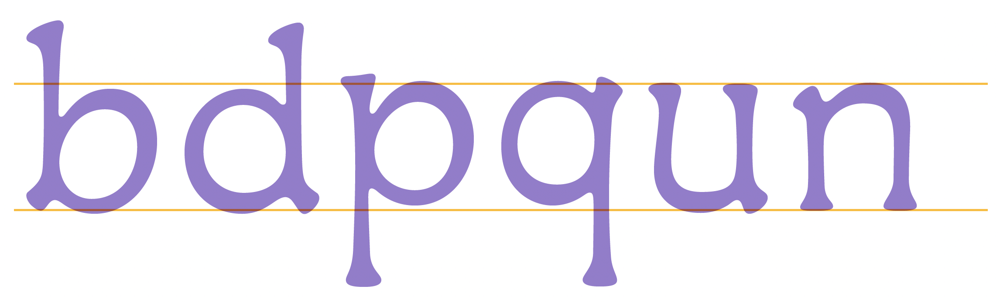
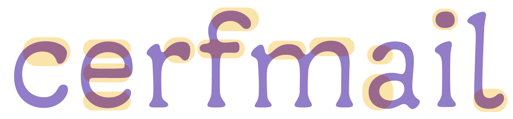
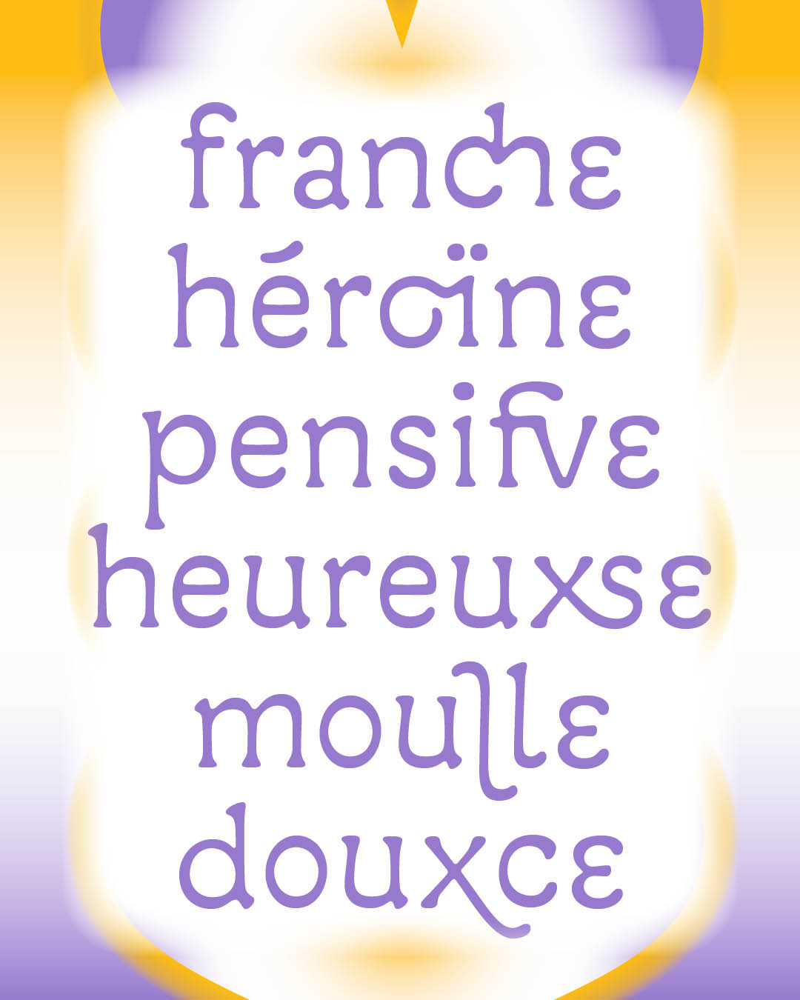
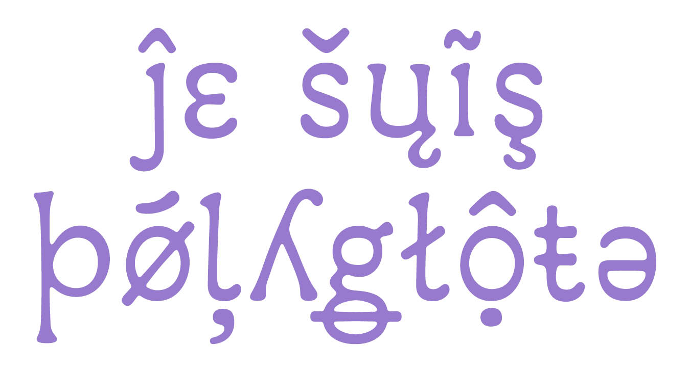
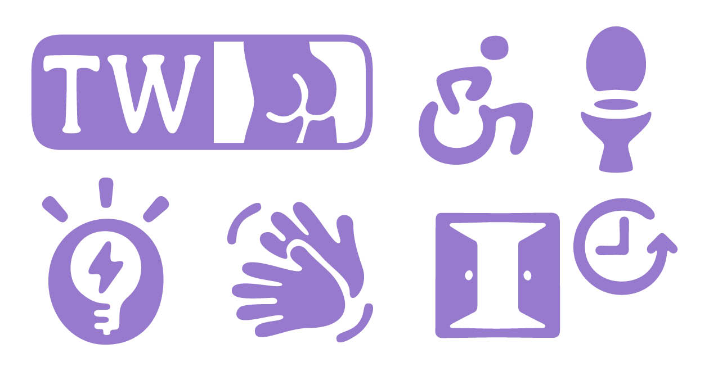

# BBB ReadMe
Depuis 2018, la collective Bye Bye Binary travaille à la création et à la diffusion de fontes post-binaires. Celles-ci permettent une écriture inclusive du français reposant sur un ensemble de ligatures et de caractères alternatifs dessinés pour cet usage et permettant une débinarisation graphique de la langue.

La fonte BBB ReadMe a été dessinée pour tenter de répondre aux besoins spécifiques des personnes ayant un trouble cognitif impactant la lecture.

## Étude de lisibilité
BBB ReadMe a été testé auprès de personnes ayant un trouble cognitif impactant la lecture (troubles dys, TDAH, TSA). L’étude s’est déroulée par le biais d’entretiens semi-directifs auprès d’un panel mixte en termes d’âge comme de genre. Ceux-ci ont permis de transmettre un ensemble de retours et recommandations aux dessinatrices de la fonte qui ont apporté les corrections nécessaires. Ces corrections ont ensuite été soumises aux participant·es de l’étude afin de confirmer ou infirmer leur efficacité. Pour en savoir plus sur cette étude, rendez-vous sur [typo-inclusive.net](https://typo-inclusive.net/conclusions-de-letude-de-lisibilite-de-la-fonte-bbb-readme/). Les résultats complets de l’étude sont disponibles dans [ce document PDF](https://safe.genderfluid.space/s/pgxYPnMk38ncMyq).

## Non modularité
Un alphabet trop modulaire est difficile à lire pour les personnes dyslexiques car certaines d’entre elles retournent les lettres dans leur tête, ce qui amener à confondre « b », « d », « p » et « q » ou « u » et « n » ou encore « I » et « l ».

## Répartition des graisses
Le contraste, c’est-à-dire la répartition des pleins (parties grasses) et des déliés (parties fines), de BBB ReadMe est particulier. Le gras des lettres est placé aux endroits les plus caractéristiques de chacune d’entre elles, afin de faciliter leur identification. Aussi les capitales et la ponctuation sont plus grasses pour faciliter l’identification du rythme des phrases.

## Post-binarisme
BBB ReadMe utilise la lettre « ·e » et un ensemble de ligatures pour écrire en français inclusif et débinarisé.

## Langues supportées (100)
afrikaans, albanais, asturien, asu, basque, bemba, bena, breton, catalan, chiga, colognien, cornique, croate, tchèque, danois, néerlandais, embu, anglais, espéranto, estonien, féroïen, philippin, finnois, français, frioulan, galicien, ganda, allemand, gusii, hawaïen, hongrois, islandais, igbo, sami d’Inari, indonésien, irlandais, italien, jola-fonyi, kabuverdianu, kalenjin, kamba, kikuyu, kinyarwanda, letton, lituanien, bas-sorabe, luo, luxembourgeois, luyia, machame, makhuwa-meetto, makonde, malgache, maltais, mannois, meru, morisyen, sami du nord, ndebele du nord, norvégien bokmål, norvégien nynorsk, nyankole, oromo, polonais, portugais, quechua, roumain, romanche, rombo, rundi, rwa, samburu, sango, sangu, gaélique écossais, sena, serbe, shambala, shona, slovaque, slovène, soga, somali, espagnol, swahili, suédois, suisse allemand, taita, teso, tongien, turc, haut-sorabe, ouzbek (latin), volapük, vunjo, walser, gallois, frison occidental, yoruba, zoulou.

## Pictogrammes inclusifs
Plusieurs ateliers participatifs organisés avec les Halles de Schaerbeek, le Kaaitheater, le Beursschouwburg et les LABdays ont été menés avec Bye Bye Binary pour définir les contours d’un set de pictogrammes inclusifs. Ces partenaires se sont montrés enthousiastes pour co-financer les premières esquisses de dessin réalisées par Mariel Nils, Eugénie Bidaut et Camille Circlude. Bien que la collective soit toujours à la recherche de financement pour finaliser les pictogrammes encore manquant, une première version est à présent intégrée à la fonte BBB ReadMe.

## Colophon
### Crédits
* Dessin de la fonte BBB ReadMe : Clara Sambot, Eugénie Bidaut & Ludi Loiseau
* Étude de lisibilité : Sophie Vela, Enz@ Le Garrec & Camille Circlude
* Distribution : Bye Bye Binary
* Design du spécimen : Eugénie Bidaut
* Impression : R·Dryer Studio, Bruxelles

### Financements
* Bye Bye Binary
* Fonds de la Recherche en Art (FRArt), fonds associé du F.R.S.-FNRS, soutenu, diffusé et promu par l’asbl A/R.
* Direction de la Culture du Patrimoine du Sport et des Loisirs du Département de la Seine‑Saint‑Denis en partenariat avec la Station – Gare des Mines (Aubervilliers) & le 6b (Saint‑Denis)
* ENSAPC | École nationale supérieure d’arts de Paris‑Cergy

### Liens
* [www.byebyebinary.space](https://www.byebyebinary.space)
* [typotheque.byebyebinary.space](https://typotheque.byebyebinary.space/frW)
* [typo-inclusive.net](https://typo-inclusive.net)